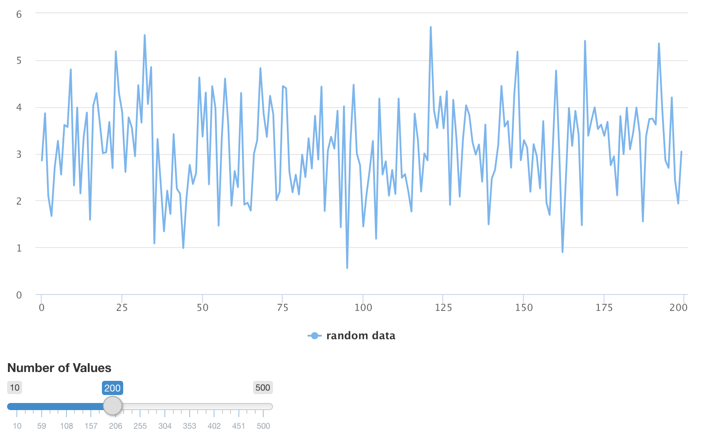
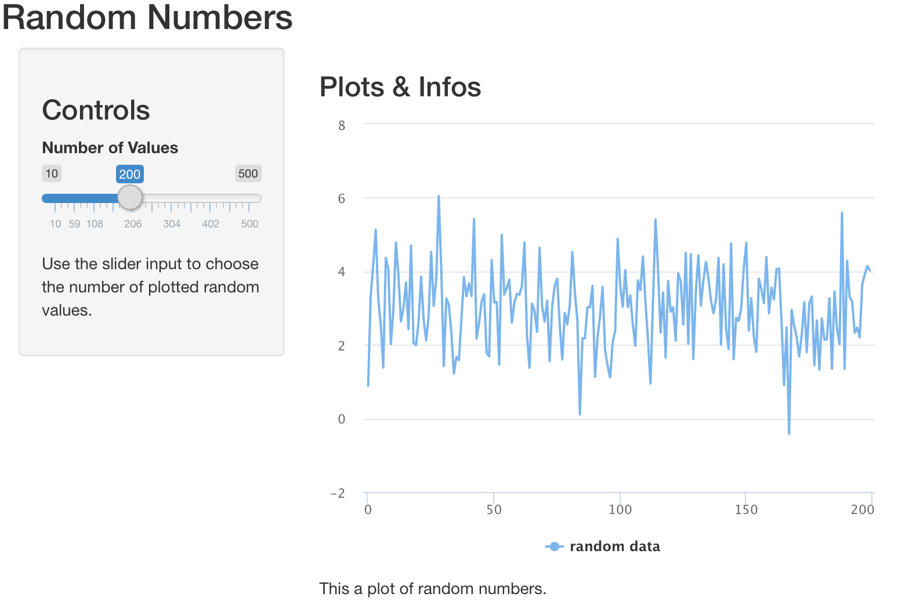
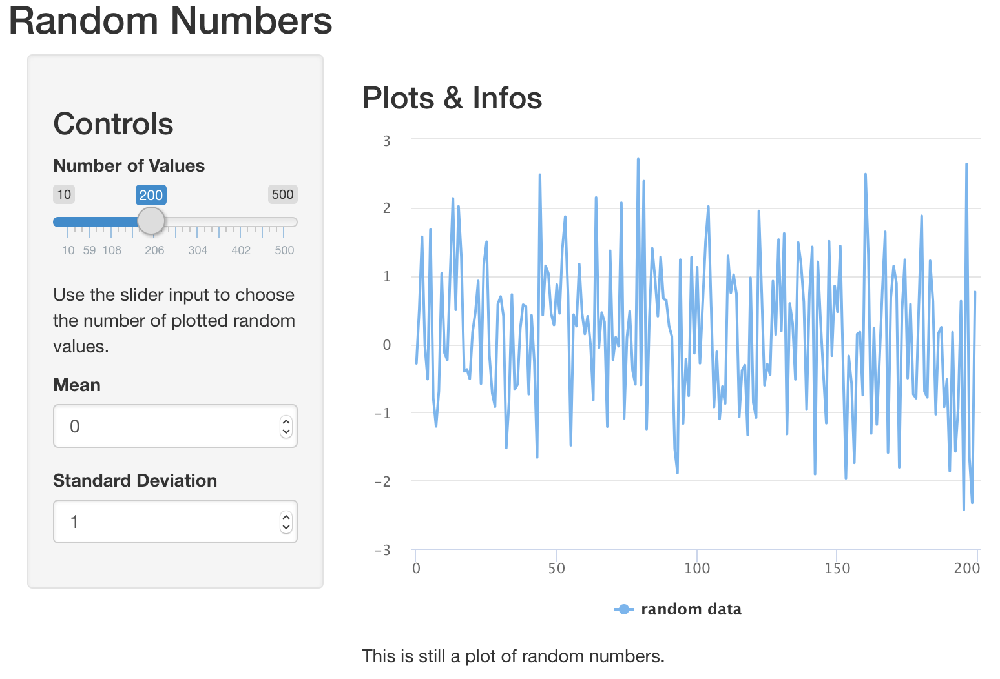
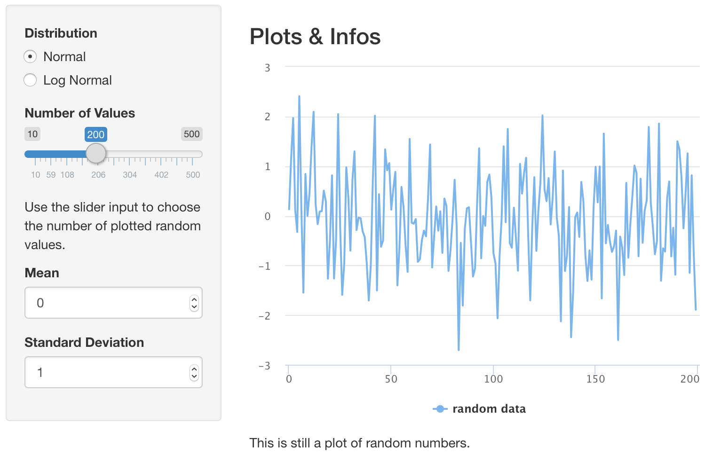
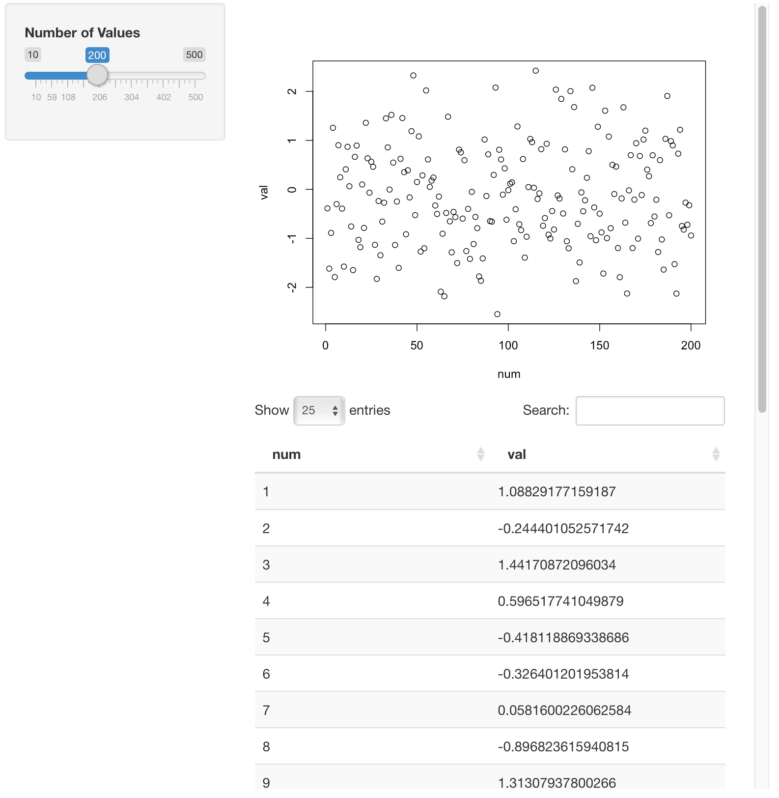

# Introduction

## What is Shiny and what is it about?
Shiny is a R package to allow to interact with plots, maps and tables to explore
data. Especially dashboards are well suited to present data in an interactive 
way. There is a number of R packages related to Shiny, which make it relatively 
easy to develop dashboards by wrapping web technologies like HTML, CSS and 
JavaScript. This workshop introduces into developing dashboards with Shiny and 
related packages. Core concepts of shiny (e.g. reactiveness) as well as 
programming techniques like modularisation and debugging will be addressed. 

## About this workshop
The aim of this workshop is to give a head start for building shiny applications
and especially dashboards. There is a lot of very good material available in the
internet especially on the webpage of [RStudio](https://shiny.rstudio.com).
We will use the documentation and tutorial there as main reference.

For plotting we use [highcharter](http://jkunst.com/highcharter/index.html), 
which is a R wrapper around the Java Script library Highcharts. This library 
respects the grammar of graphics, uses pipes and allows to demonstrate the usage 
of Java Script wrappers and their extension with Java Script in R. The usage of 
Highcharts is not free for commercial and governmental use, but we are allowed 
to use it for scientific and educational purposes.

At the end of this workshop you will have build a Shiny Dashboard an will know
where and how to find help about Shiny and related technologies quickly.

## Ressources
RStudio's Shiny web page  [shiny.rstudio.com](https://shiny.rstudio.com) is your
first choice. There is nothing better for self-study then the RStudio web page. 
There, you can find introductory tutorial videos, webinars and articles about 
advanced shiny programming.

Everything else we are going to use is mostly well documented. You will find
links to tutorials and documentation pages throughout this script and an number 
of links at [the end](#links) of this document.

## Prerequisites
Requirements:

- Intermediate R programming skills 
- knowing how to use dplyr and pipes
- having a rough understanding of the grammar of graphics would be advantageous.

Needed software: 

- R preferably 3.4.1 or later 
- RStudio (latest version is always best) 
- shiny 1.0.5 or later 
- shinydashboard 0.6.1 or later 
- flexdashboard 0.5 or later 
- tidyverse 1.1.1 or later 
- highcharter 0.5.0 or later 
- packrat 0.4.8 or later. 

This is for a start. It will be probably necessary to install further packages 
from the internet during the workshop.

# Basic Shiny
## First Example

The following is a first example of a simple Shiny app, which displays some 
random numbers. The app allows to choose the number of random values. You do not
have to understand all parts of the code right now. The details of the code will
be discussed in the following sections.

```{r include=FALSE}
library(shiny)
library(highcharter)
```


```{r, eval=FALSE}
library(shiny)
library(highcharter)

# Define program logic inside the server function.
server <- function(input, output) {
  # Define the output
  output$noise_plot <- renderHighchart({
    # Lets make some noise!
    val <- rnorm(n = input$num, mean = 3, sd = 1)
    num <- seq(1:input$num)
    dta <- dplyr::bind_cols(num = num, val = val)
    
    # Create the plot.
    highcharter::highchart() %>% 
      highcharter::hc_xAxis(dta$num) %>% 
      highcharter::hc_add_series(name = "random data",
                                 data = dta$val)
  })
}

# Define the user interface inside the ui list.
ui <- fluidPage(
  highcharter::highchartOutput("noise_plot"),
  sliderInput("num", "Number of Values", min = 10, max = 500, value = 200)
)

# The shiny app is created here.
shinyApp(ui = ui, server = server, options = list(height = 550))
```



## Basic App Design
### app.R
On the top level of your working directory lives the file app.R, which has the
following structure:

```{r eval=FALSE}
library(shiny)

# All the logic, data crunching, tidying, and wrangling goes here.
# (That is not always true, but it is the default case.)
# Technically server is a function.
server <- function(input, output) {

}

# The user interface is defined here. Technically ui is a list.
ui <- fluidPage(
  
)

# The shiny app is created here.
shinyApp(ui = ui, server = server)
```


### server.R and ui.R
In larger projects `server` and `ui` live in separate files on the top level of
your working directory. 

### Linking Inputs and Outputs
Inside the server function output elements are constructed and input elements
are logically linked to them. Inside the ui list input and output elements are 
arranged.

### Exercise
> 1. Create a working directory for your first app. Copy the code of the first
> example into your RStudio editor and save the file in your working directory.
> Run the app by typing 
> [`runApp()`](https://shiny.rstudio.com/reference/shiny/1.0.5/runApp.html) 
> into the console or press the _Run App_ button in the upper left corner.
> 2. Add two more sliders to the first example to allow users to adjust mean and
> standard deviation.

## Layout of user interfaces
The `ui`-list is created by the function 
[`fluidPage()`](https://shiny.rstudio.com/reference/shiny/1.0.5/fluidPage.html). 
This function arranges interface elements and adjusts the layout to the browser, 
where your app runs. A simple layout may look like this:

```{r eval=FALSE}
ui <- fluidPage(
  titlePanel("title panel"),
  
  sidebarLayout(
    sidebarPanel("this a sidebar panel"),
    mainPanel("this is the main panel")  
)
```

This is the framework for a simple straight forward user interface. See the
reference pages of
[`titlePanel()`](https://shiny.rstudio.com/reference/shiny/1.0.5/titlePanel.html),
[`sidebarLayout()`](https://shiny.rstudio.com/reference/shiny/1.0.5/sidebarLayout.html),
[`sidebarPanel()`](https://shiny.rstudio.com/reference/shiny/1.0.5/sidebarPanel.html),
and
[`mainPanel()`](https://shiny.rstudio.com/reference/shiny/1.0.5/mainPanel.html)
for more details.

Inside the 
[`sidebarLayout()`](https://shiny.rstudio.com/reference/shiny/1.0.5/sidebarLayout.html)
and
[`mainPanel()`](https://shiny.rstudio.com/reference/shiny/1.0.5/mainPanel.html)
you can place your input and output elements as well as formatted text:

```{r eval=FALSE}
ui <- fluidPage(
  titlePanel("Random Numbers"),
  
  sidebarPanel(
    h3("Controls"),
    sliderInput("num", "Number of Values", min = 10, max = 500, value = 200),
    p("Use the slider input to choose the number of plotted random values.")
  ),
  
  mainPanel(
    h3("Plots & Infos"),  
    highcharter::highchartOutput("noise_plot"),
    p("This a plot of random numbers.")
  )
)
```




This example shows the HTML builder functions 
[`h3()`](https://shiny.rstudio.com/reference/shiny/1.0.5/builder.html) and 
[`p()`](https://shiny.rstudio.com/reference/shiny/1.0.5/builder.html). These are
basically wrappers around HTML tags. There is a lot more of these functions.
More examples and details are given in the 
[RStudio Shiny Tutorial](https://shiny.rstudio.com/tutorial/written-tutorial/lesson2/).

## Controlls
In the example above we have already used the 
[`sliderInput()`](https://shiny.rstudio.com/reference/shiny/1.0.5/sliderInput.html)
to allow users to select specific values. The first parameter of 
[`sliderInput()`](https://shiny.rstudio.com/reference/shiny/1.0.5/sliderInput.html)
is its inputId. We access the value of the input by referencing this ID in the 
server via `input$inputId`.

There is a lot more to say about control widgets. An overview about this is 
given in Lesson 3 of the 
[RStudio Shiny Tutorial](https://shiny.rstudio.com/tutorial/written-tutorial/lesson3/).
In the following you see the usage of a few control widgets:

```{r eval=FALSE}
ui <- fluidPage(
  titlePanel("Random Numbers"),
  sidebarPanel(
    h3("Controls"),
    sliderInput("num", "Number of Values", min = 10, max = 500, value = 200),
    p("Use the slider input to choose the number of plotted random values."),
    numericInput("mean", h3("Mean"), value = 0),
    numericInput("sd", h3("Standard Deviation"), value = 1)
  ),
  mainPanel(
    h3("Plots & Infos"),  
    highcharter::highchartOutput("noise_plot"),
    p("This is still a plot of random numbers.")
  )
)
```



### Exercise
> Extend your app so that it looks like the following. You might want to refer 
> to [`radioButtons()`](https://shiny.rstudio.com/reference/shiny/1.0.5/radioButtons.html) 
> and [`numericInput()`](https://shiny.rstudio.com/reference/shiny/1.0.5/numericInput.html).




## Outputs
In the examples and exercises above we already used the 
[`highchartOutput()`](http://jkunst.com/highcharter/shiny.html). This 
function displays plots generated with the 
[`highcharter`](http://jkunst.com/highcharter/index.html) 
package. 

There are also many other output types already included in the `shiny` package.
You can get an overview in Lesson 4 of the 
[RStudio Shiny Tutorial](https://shiny.rstudio.com/tutorial/written-tutorial/lesson4/).
Two of these outputs are demonstrated in the following example:
```{r eval=FALSE}
server <- function(input, output) {
  # Define the output
  output$noise_plot <- renderPlot({
    # Lets make some noise!
    val <- rnorm(n = input$num, mean = 0, sd = 1)
    num <- seq(1:input$num)
    dta <- dplyr::bind_cols(num = num, val = val)
    
    # Create the plot.
    plot(dta)
  })
  
  output$noise_table <- renderDataTable({
    # Lets make some noise!
    val <- rnorm(n = input$num, mean = 0, sd = 1)
    num <- seq(1:input$num)
    dta <- dplyr::bind_cols(num = num, val = val)
    
    # Return the table data.
    dta
  })
}

ui <- fluidPage(
  sidebarPanel(
    sliderInput("num", "Number of Values", min = 10, max = 500, value = 200)
  ),
  
  mainPanel(
    plotOutput("noise_plot"),
    dataTableOutput("noise_table")
  )
)
shinyApp(ui = ui, server = server, options = list(height = 800))
```



The outputs used here are the standard shiny 
[plot output](https://shiny.rstudio.com/reference/shiny/1.0.5/plotOutput.html)
and the shiny 
[output for data tables](https://shiny.rstudio.com/reference/shiny/1.0.5/tableOutput.html).

### Exercise
> 1. Extend your app by 
> [`dataTableOutput()`](https://shiny.rstudio.com/reference/shiny/1.0.5/tableOutput.html) and 
> [`renderDataTable()`](https://shiny.rstudio.com/reference/shiny/1.0.5/renderDataTable.html).
> 2. Change your table (e.g. number of shown lines).
> 3. Change the layout of your app: You now want to display the plot and the 
> table side by side. (Hint: 
> [`column()`](https://shiny.rstudio.com/reference/shiny/1.0.5/column.html) and
> [`fluidRow()`](https://shiny.rstudio.com/reference/shiny/1.0.5/fluidPage.html)) 

```{r echo=FALSE, eval=FALSE}
server <- function(input, output) {
  # Define the output
  output$noise_plot <- renderPlot({
    # Lets make some noise!
    val <- rnorm(n = input$num, mean = 0, sd = 1)
    num <- seq(1:input$num)
    dta <- dplyr::bind_cols(num = num, val = val)
    
    # Create the plot.
    plot(dta)
  })
  
  output$noise_table <- renderDataTable({
    # Lets make some noise!
    val <- rnorm(n = input$num, mean = 0, sd = 1)
    num <- seq(1:input$num)
    dta <- dplyr::bind_cols(num = num, val = val)
    
    # Return the table data.
    dta
  })
}

ui <- fluidPage(
  title = "Random Numbers",
  
  fluidRow(
    column(width = 2,
      h3("Controls"),
      sliderInput("num", "Number of Values", min = 10, max = 500, value = 200)
    ),
    column(width = 6,
      h3("Plot"),  
      plotOutput("noise_plot")
    ),
    column(width = 4,
      h3("Plot"),  
      dataTableOutput("noise_table")
    )
  )
)
shinyApp(ui = ui, server = server, options = list(height = 800))
```


## Reactivity
This is the core concept of shiny. Understanding this is crucial for writing 
correct and efficient code and, in the end, for being able to develop more 
complex apps like dashboards. The code of Shiny apps is not executed 
sequentially but on demand. Code parts react to what is happening in other code
parts. This reactivity could be understood by a directed information 
propagation graph. In this graph information is propagated from root nodes to 
the leaves. 

We used reactiveness implicitly in all the examples: `output$...` reacts to 
changes is `input$...`. A simple information propagation graph looks as
follows:

)](https://shiny.rstudio.com/images/reactivity_diagrams/simplest.png)

On the left there is some `input$...` element (called _reactive source_). On the 
right there is an `output$...` element (called _reactive endpoint_) reacting to 
changes in the input. This means the code for generating the output (e.g. a plot 
or a table) inside the server function is executed: Every time we move the slider 
input in our latest app the functions `renderPlot()` and `renderTable()` are 
re-executed.

This has the advantage, that code is only executed if it is necessary. 
What we also want is that we execute as little code as possible to update the
output. Thus we want to avoid redundant code execution.

In out last example above, the `server()` code contains the following part 
twice (with different results!), in `renderPlot()` and `renderTable()`.

```{r eval=FALSE}
    # Lets make some noise!
    val <- rnorm(n = input$num, mean = 0, sd = 1)
    num <- seq(1:input$num)
    dta <- dplyr::bind_cols(num = num, val = val)
```

This means the calculation of `dta` is done twice. You always want to avoid this
(especially for costly calculations). In these situation we can introduce a
_reactive conductor_, which is executed before the _reactive endpoints_ are 
calculated. The information propagation graph looks as follows:

)](https://shiny.rstudio.com/images/reactivity_diagrams/conductor.png)

The corresponding `server()` code is shown in the following:

```{r eval=FALSE}
server <- function(input, output) {
  # Do the calculations
  dta <- reactive({
    # Lets make some noise!
    val <- rnorm(n = input$num, mean = 0, sd = 1)
    num <- seq(1:input$num)
    dta <- dplyr::bind_cols(num = num, val = val)
    dta
  })
  
  # Define plot output
  output$noise_plot <- renderPlot({
    # Create and return the plot.
    plot(dta())
  })
  
  # Define table output
  output$noise_table <- renderDataTable({
    # Return the table data.
    dta()
  })
}
```

Now, variable `dta` becomes reactive (i.e. a responsive conductor). Note that
responsive conductors are followed by `()` when they are called.

### Exercise
> Modify your app, that `dta` is only calculated once.

For more information you may want to refer to
[lesson 6](https://shiny.rstudio.com/tutorial/written-tutorial/lesson6/)
of the RStudio shiny tutorial. For exhaustive information on this topic see 
[RStudio's articles about reactivity](https://shiny.rstudio.com/articles/#reactivity).

# Debugging
To understand what your app is doing you can and want to apply various debugging 
techniques. In the following we examine three of them. There is also an RStudio
article on [debugging](https://shiny.rstudio.com/articles/debugging.html) shiny 
apps.

## Showcase
Simple apps can be run in _showcase mode_. This can help to understand how
reactivity works and which part of code is executed under which circumstances.
You start your app in the console by typing:
```{r eval=FALSE}
runApp("MyApp", display.mode = "showcase")
```

You can find examples of running apps in showcase mode at the RStudio
[gallery](https://shiny.rstudio.com/gallery/) e.g. in
[iris k-means clustering](https://shiny.rstudio.com/gallery/kmeans-example.html).

### Exercise
> Introduce `radioButtons()` in your `ui` list, which let you choose the color
> of plotted points. Run your app in showcase mode. Hint: Your `plot()` should
> look like that: `plot(dta(), col = input$col)`.


## Reactive Log
Another way to understand the reactive nature of your app is to examine the 
_reactive log_ of your app. Basically, with this function you can examine the
information propagation graph of your app. To start the reactive log execute

- `options(shiny.reactlog=TRUE)` in your RStudio console,
- start your app by `runApp('app.R')`, 
- perform one or two actions in your app, and 
- hit CTRL+F3 (or for Mac users fn+Command+F3).

You then see the reactive log of your app for the actions you just performed.

### Exercise
> Just try this with your last app.

## `browser()`
Especially in larger apps and for developing complicated parts of your code 
which may refer to a certain state of your app, showcase and reactive log are
not helpful. In these situation you want to use the `browser()` function. You
can put it anywhere in your R-code. Code execution stops as soon as it passes
the `browser()`. You then can analyse the state of your app, e.g. examine 
values of variables.

### Example
```{r eval=FALSE}
server <- function(input, output) {
  # Do the calculatins
  dta <- reactive({
browser()    
    # Lets make some noise!
    val <- rnorm(n = input$num, mean = 0, sd = 1)
    num <- seq(1:input$num)
    dta <- dplyr::bind_cols(num = num, val = val)
    dta
  })
  
  ...
}
```

### Exercise
> Try this and play around.

Do not forget to remove all `browser()` calls from your code after debugging!

# Dashboards
As soon as you want to communicate more complex data analyses and allow for 
users to play around with your data, you need to organize your inputs and outputs 
in some meaningful way. For this purpose dashboards are used. At the moment 
there are (at least) two R packages to build dashboards: 
[flexdashboard](http://rmarkdown.rstudio.com/flexdashboard/) and 
[shinydashboard](http://rstudio.github.io/shinydashboard/). In the following a
brief overview is given. You will learn more about dashboards later on in the 
project.

## Flexdashboard 
The [flexdashboard](http://rmarkdown.rstudio.com/flexdashboard/shiny.html) 
package uses [rmarkdown](http://rmarkdown.rstudio.com) to structure a dashboard. 
The advantage of rmarkdown is that is easy to code. The disadvantage is that it 
is not only R, which means that some things do not work as expected (e.g. 
debugging with `browser()`). The flexdashboard package features many interesting 
layouts. The following is a simple example of a flexdashboard:

### Example
```{r eval=FALSE}
---
title: "Random Numbers"
runtime: shiny
output:
  flexdashboard::flex_dashboard:
    source: embed
    vertical_layout: fill
---

Plot and Data
=======================================================================

Column {.sidebar}
-----------------------------------------------------------------------

### Controls

This is a sidebar on the left.

``{r}
radioButtons("col", h3("Point Color"),
             choices = list("Red" = "red", "Blue" = "blue"),
             selected = "blue")
sliderInput("num", "Number of Values", min = 10, max = 500, value = 200)
numericInput("mean", h3("Mean"), value = 0)
numericInput("sd", h3("Standard Deviation"), value = 1)
``

Column {.tabset}
-----------------------------------------------------------------------

### Plot

This is a tab.

``{r}
dta <- reactive({
  val <- rnorm(input$num, input$mean, input$sd)
  num <- seq(1:input$num)
  dta <- dplyr::bind_cols(num = num, val = val)
})

# Define the output
renderPlot({
  # Create the plot.
  plot(dta(), col = input$col)
})
``

### Table

This is another tab.

``{r}
renderDataTable(
  # Return the table data.
  dta(), 
  options = list(pageLength = 10)
)
``

More Information
=======================================================================

This is a new page. Here, you might want to provide further content.
```

### Exercise
> Create a new .Rmd file inside your RStudio IDE and copy the example code into 
> this file. (__Note, you need to replace ` `` ` by ` ``` `!__ Otherwise the code is
> not syntactically correct.) 
> Play around with the dashboard. Later on, it might be the starting point for 
> your own project.

## Shinydashboard
The [shinydashboard](http://rstudio.github.io/shinydashboard/) package uses the
'regular' shiny approach to structure the dashboard. This might be slightly 
more complicated than flexdashboard, but it is more flexible and it is R only, 
which means, everything works as expected. The shinydashboard package provides 
many features like menus for notifications or messages, boxes to display values, 
and different styles and layouts.

The basic structure of a shinydashboard looks as follows:
```{r include=FALSE}
library(shinydashboard)
```
```{r eval=FALSE}
# Telling, the ui, that this is a dashboard page.
ui <- dashboardPage(
  # First define the dashboard header.
  dashboardHeader(title = "Shiny dashboard"),
  # Second define the sidebar of the dashboard.
  dashboardSidebar(
    # Inside the sidebar you might want to place a menue ...
    sidebarMenu(
      menuItem("Title Item1", tabName = "item1"),
      menuItem("Title Item2", tabName = "item2")
    ),
    # ... or some input elements.
    sliderInput("input1", "Title Input2", min = 1, max = 10),
    numericInput("input2", "Title Input1", value = 0),
  ),
  # Third the body of the dashboard is defined.
  dashboardBody(
    # Inside the body you list all the tabs. 
    tabItems(
      # Tab items are referenced by the menu items. 
      tabItem(tabName = "item1",
        # The structure inside the tab is similar to ordinary Shiny apps.
        fluidRow(
          # Everything which is to be shown is wrapped in boxes.
          box(),
          box()
        )
      ),
      # The second tab item.
      tabItem(tabName = "item2",
        fluidRow(
          box()
        )
      )
    )
  )
)
```


Note, the structure of the shinydashboard only affects the `ui` list. The server
remains the same as in a regular shiny app. Examine the following working example:

### Example
```{r eval=FALSE}
library(shinydashboard)

ui <- dashboardPage(
  dashboardHeader(title = "Shiny dashboard"),
  dashboardSidebar(
    sidebarMenu(
      menuItem("Plot", tabName = "plot_item", icon = icon("area-chart")),
      menuItem("Data", tabName = "table_item", icon = icon("table")),
      menuItem("More", tabName = "more_item", icon = icon("plus-square"))
    ),
    sliderInput("num", "Number of Values", min = 10, max = 500, value = 200),
    numericInput("mean", "Mean", value = 0),
    numericInput("sd", "Standard Deviation", value = 1)
  ),
  dashboardBody(
    tabItems(
      tabItem(tabName = "plot_item",
        # The structure inside the tab is similar to ordinary Shiny apps
        fluidRow(
          box(width = 8, plotOutput("plot", height = 250)),
          box(
            width = 4,
            title = "Controls",
            radioButtons("col", "Point Color",
                         choices = list("Red" = "red", "Blue" = "blue"),
                         selected = "blue")
          )
        )
      ),
      tabItem(tabName = "table_item",
        # The structure inside the tab is similar to ordinary Shiny apps
        fluidRow(
          box(width = 12, dataTableOutput("table"))
        )
      ),
      tabItem(tabName = "more_item",
        # The structure inside the tab is similar to ordinary Shiny apps
        fluidRow(
          "More content."
        )
      )
    )
  )
)

server <- function(input, output) {
  # Generate data reactively
  dta <- reactive({
    val <- rnorm(input$num, input$mean, input$sd)
    num <- seq(1:input$num)
    dta <- dplyr::bind_cols(num = num, val = val)
  })
  
  # Define the outputs
  output$plot <- renderPlot({
    # Create the plot.
    plot(dta(), col = input$col)
  })
  
  output$table <- renderDataTable(
    # Return the table data.
    dta(), 
    options = list(pageLength = 10)
  )
}

shinyApp(ui, server, options = list(height = 700))
```


### Exercise
> Create a new R file inside your RStudio IDE and copy the example code into 
> this file. Play around with the dashboard. Later on, it might be the starting 
> point for your own project.

# Project
## Next Steps
Now, we have done a brute force ride through features of Shiny. Now, you can 
choose one out of three options for your next steps in this workshop. The aim is 
to deepen and extend your understanding of Shiny. The three options are:

1. You are pretty new to R and or programming and want to understand the basics
more in depth: Take the 
[RStudio Shiny Tutorial](https://shiny.rstudio.com/tutorial/written-tutorial/lesson1/) 
and read [other articles](https://shiny.rstudio.com/articles/) about Shiny. This 
is high quality material, but if you need support, you will get it here.

2. You got the basic idea of Shiny and want to know more about dashboards: Go on 
with one of the example dashboards. You can read about this in the following.

3. You are pretty confident that you are able to develop your own dashboard: Go 
on with this and take the first steps towards your own app. Take one of the 
examples above or one of the two working dashboards below as a starting point. 
You will get as much support as possible.

## A Shiny Weather Dashboard 
This dashboard allows to compare the forecast data from different providers and 
assess its reliability.

### Data
As toy example we will create an app which shows weather forecast data from four
web sites for further analyses:

- [wetter.com](http://www.wetter.com), which provides weather data e.g. for 
[Spiegel Online](http://www.spiegel.de); 
- [wetter.de](http://www.wetter.de); 
- [weather.com](https://weather.com), which provides (among others) data for the 
Apple weather app;
- [wetterkontor.de](http://www.wetterkontor.de), which provides weather data e.g. 
for Bild.de.

The data is scraped from these web sites using 
[rvest](https://github.com/hadley/rvest) and 
[RSelenium](https://cran.r-project.org/web/packages/RSelenium/). Scraping 
happens on a daily basis and is not part of the dashboard.

### Dashboard structure
The dashboard comes in two versions: as 
[flexdashboard](http://rmarkdown.rstudio.com/flexdashboard/) and as
[shinydashboard](http://rstudio.github.io/shinydashboard/). Both dashboards use
modules to encapsulate different parts of the app. To access the data we will
use a R6-class. You will learn about modules and R6 classes first and then go on 
with one of the two dashboards. Apart from the modules both dashboards are 
structured according to what you have learned above. 

### Exercises
> A good way to learn is to work with and extend existing code.  
>
> 1. If you decide to work on the Shiny Weather dashboard  
>
>  - you can download the 
>    data from [Dropbox](https://www.dropbox.com/s/nohq6vgyfb43y1o/dta.zip?dl=0). 
>  - As a starting point you can get the source code for the flexdashboard from 
>    [github](https://github.com/stenzei/ShinyWeather). 
>  - Alternatively you can get the whole bundle also from
>    [Dropbox](https://www.dropbox.com/s/57c0s9fkrwfep2g/MetaWeather_FlexDashb-2017-10-06.tar.gz?dl=0) 
>    and then use `packrat::unbundle()`.
>  - A bundle of the Shiny Weather shinydashboard is available on 
>    [Dropbox]((https://www.dropbox.com/s/aix5akbe28talrc/MetaWeather_ShinyDashb-2017-10-06.tar.gz?dl=0)) 
>    as well.
>
> 2. Get your version of the Dashboard locally running and play around.    
> 3. Add a new tab to the dashboard which displays a table showing all the data.
> 4. Add further tabs for further views on the data (e.g. you might want to show
>    weather history)
> 5. All the data is loaded at once when the dashboard is started. Change the 
>    code, so that only data is loaded which is really needed at start-up time.
>    Introduce a button to trigger loading the rest of the data. 
> 6. You might want to improve the plots, add other types of plots, add more 
> details to the map, introduce more inputs to increase interactivity. Go ahead!
> Try to keep the structure given and extend it.


# Advanced techniques
There are two further techniques used in the Shiny Weather dashboards, which are
briefly described in the following.

## Modules
Modules are a good way to manage complex application code. They can be seen as 
independent building blocks of your dashboard or application. They consist of an
`ui` part and a `server` part, both defined in a single file. You can find a good 
[introduction into using modules](https://shiny.rstudio.com/articles/modules.html) 
on the RStudio website. An example showing the basic structure of a
module is given in the 
[RStudio gallary](http://shiny.rstudio.com/gallery/module-example.html).

The two Shiny Weather dashboards use the same modules. I.e. the modules are
just plugged into different dashboard frameworks.

## R6-classes
R6-classes allow for the object-oriented programming paradigm and are easier 
to understand than the other types of R classes. Classes in general help to
encapsulate and structure code in larger code bases. In the Shiny Weather 
dashboard a R6-class is used to encapsulate data processing.

For a comprehensive introduction on R6 classes there is a
[vignette of the package](https://cran.r-project.org/web/packages/R6/vignettes/Introduction.html).
The following example shows the basic structure of a R6-class.

### Example
```{r}
library(R6)

Animal <- R6Class("Person",
  # List of public class memders. This can be variables or functions.
  # Public members are accessible form the outside of the class.
  public = list(
    name = NULL,
    species = NULL,
    
    # This function is called everytime a new object of this 
    # class is instanziated.
    initialize = function(name = NA, species = NA, legs = NA) {
      
      # Set variables of the class.
      self$name <- name
      self$species <- species
      private$number_of_legs <- legs
      
      # Call private function of the class.
      private$say_hi()
    },
    
    # Define a public function.
    set_legs = function(legs) {
      private$number_of_legs <- legs
      private$say_hi(again = TRUE)
    }
  ),
  # List of private members, which are only accessible from inside the class. 
  private = list(
    # Definition of a private variable.
    number_of_legs = NULL,
    
    # Define a private function.
    say_hi = function(again = FALSE) {
      if (!again) {
        cat(paste0("Hi, I am ", self$name, ", the ", 
                   private$number_of_legs, "-leged ", self$species, ".\n"))
      } else {
        cat(paste0("Hi, now I am ", self$name, ", the ", 
                   private$number_of_legs, "-leged ", self$species, ".\n"))
      }
    }
  )
)
```


The shown R6-class can be used as follows.
```{r}
# Instantiate an object of class Animal
animal_sam <- Animal$new("Sam", "dog", "4")

# Call a public function of that class
animal_sam$set_legs(3)

# Public member variables are also accessible
animal_sam$name
```


#Links {#links}
Some links to helpful resources:

- [Cheetsheets](https://www.rstudio.com/resources/cheatsheets/)
- [RStudio](https://shiny.rstudio.com)
- [Shiny](https://shiny.rstudio.com)
- [Rmarkdown](http://rmarkdown.rstudio.com)
- [Flexdashboard](http://rmarkdown.rstudio.com/flexdashboard/)
- [Shinydashboard](https://rstudio.github.io/shinydashboard/)
- [Highcharter](http://jkunst.com/highcharter/index.html) 
- [Some more of the most helpfull packages for data science](https://www.rstudio.com/products/rpackages/) 
